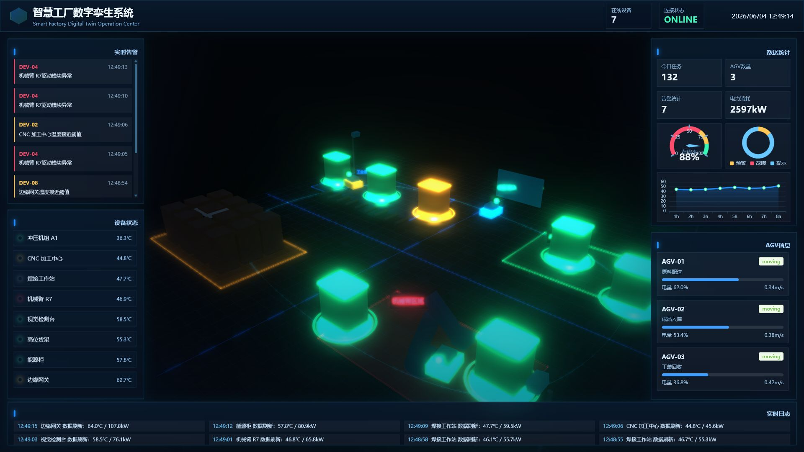

# Smart Factory Digital Twin

<p align="right">
  <a href="#中文">中文</a> | <a href="#english">English</a>
</p>

<a id="中文"></a>

## 中文

一个面向作品集展示的智慧工厂数字孪生前端项目。项目基于 Vue 3、TypeScript、Vite、Three.js、Element Plus 与 ECharts 构建，模拟工厂车间、AGV 巡航、IoT 设备状态、实时告警、数据大屏与 3D 交互联动。



## 联系与商务合作

如果你对本项目有任何疑问、改进建议，或希望进行数字孪生、Three.js 3D 可视化、工业大屏、前端工程化等相关商务合作，欢迎通过微信联系我。


## 功能说明

- 工厂车间数字孪生场景：包含 AGV 运输区、工业设备区、仓储区、机械臂区域、摄像头区域和数据看板区域。
- Three.js 工业场景：使用 `WebGLRenderer`、`PerspectiveCamera`、`OrbitControls`、`EffectComposer`、`UnrealBloomPass` 和 FXAA 后期。
- AGV 巡航系统：基于 `CatmullRomCurve3` 实现循环路径，使用 `Quaternion` 平滑转向，支持多 AGV、速度配置和状态机。
- IoT 设备系统：设备支持 `running`、`warning`、`error`、`offline` 状态，不同状态拥有颜色、发光和告警脉冲表现。
- 实时数据模拟：`WebSocketService` 模拟设备温度、功率、电量、告警、AGV 状态和实时日志推送。
- 鼠标交互：基于 `Raycaster` 支持设备 hover、点击高亮和实时数据弹窗。
- 数据大屏：使用 ECharts 展示设备在线率、AGV 数量、今日任务数、告警统计、电力消耗和温度趋势。
- 性能优化：包含 `requestAnimationFrame` 渲染循环、`InstancedMesh`、Frustum Culling、DracoLoader、KTX2Loader、资源释放和自适应 Resize。

## 技术栈

- Vue 3
- TypeScript
- Vite
- Three.js
- Element Plus
- ECharts
- Pinia

## 项目结构

```text
src/
  assets/        全局样式与静态资源
  components/    大屏布局、图表和 Three.js 视口组件
  managers/      AGV、设备等业务对象管理器
  scene/         Three.js 主场景编排
  store/         Pinia 实时状态管理
  three/         模型加载、缓存和释放能力
  types/         工厂业务类型定义
  utils/         时间、资源释放等工具函数
  views/         页面级视图
  websocket/     WebSocket 实时数据模拟服务
public/
  basis/         KTX2 / Basis 纹理解码器
  draco/         Draco 模型解码器
docs/
  images/        README 演示截图
```

## 核心模块

- `src/scene/FactoryScene.ts`：Three.js 场景初始化、灯光、后期、工厂布局、Raycaster 交互和渲染循环。
- `src/three/ModelManager.ts`：GLTF/GLB 模型加载、缓存、实例化、Draco/KTX2 支持和资源释放。
- `src/managers/AGVController.ts`：AGV 路径巡航、状态机、平滑转向和运行时遥测。
- `src/managers/DeviceManager.ts`：设备对象创建、状态视觉映射、hover/selected 高亮和动画。
- `src/websocket/WebSocketService.ts`：实时数据模拟推送，驱动 UI 和 3D 场景联动。
- `src/views/FactoryDigitalTwin.vue`：页面编排和实时数据订阅入口。

## 本地运行

```bash
npm install
npm run dev
```

默认开发地址：

```text
http://localhost:5173
```

## 构建

```bash
npm run build
```

构建产物会输出到 `dist/`。

## 本地预览生产包

```bash
npm run preview
```

## 部署说明

### 静态服务器部署

执行构建后，将 `dist/` 目录部署到任意静态服务器即可，例如 Nginx、Apache、OSS、COS、Vercel、Netlify 或 GitHub Pages。

```bash
npm run build
```

### GitHub Pages 部署

项目已使用相对资源路径配置，适合部署到 GitHub Pages 的仓库子路径。

推荐流程：

1. 推送代码到 GitHub。
2. 执行 `npm run build`。
3. 将 `dist/` 目录作为 Pages 发布目录，或使用 GitHub Actions 自动构建发布。

一个最小 GitHub Actions 示例：

```yaml
name: Deploy GitHub Pages

on:
  push:
    branches: [main]

jobs:
  deploy:
    runs-on: ubuntu-latest
    permissions:
      contents: read
      pages: write
      id-token: write
    steps:
      - uses: actions/checkout@v4
      - uses: actions/setup-node@v4
        with:
          node-version: 20
          cache: npm
      - run: npm ci
      - run: npm run build
      - uses: actions/upload-pages-artifact@v3
        with:
          path: dist
      - uses: actions/deploy-pages@v4
```

## 浏览器兼容

建议使用支持 WebGL2 的现代浏览器：

- Chrome
- Edge
- Firefox
- Safari 16+

## 开源协议

本项目基于 MIT License 开源，详见 [LICENSE](./LICENSE)。

<p align="right">
  <a href="#smart-factory-digital-twin">返回顶部</a> | <a href="#english">English</a>
</p>

---

<a id="english"></a>

## English

<p align="right">
  <a href="#中文">中文</a> | <a href="#smart-factory-digital-twin">Back to Top</a>
</p>

Smart Factory Digital Twin is a portfolio-ready frontend project for industrial digital twin visualization. It is built with Vue 3, TypeScript, Vite, Three.js, Element Plus, and ECharts, simulating a factory workshop, AGV patrol routes, IoT device telemetry, real-time alarms, dashboard analytics, and 3D interaction.


## Contact and Business Cooperation

If you have any questions, suggestions, or business cooperation needs related to digital twins, Three.js 3D visualization, industrial dashboards, or frontend engineering, feel free to contact me via WeChat.


## Features

- Factory workshop digital twin scene with AGV transport area, industrial equipment area, warehouse area, robotic arm area, camera monitoring area, and dashboard area.
- Industrial Three.js scene using `WebGLRenderer`, `PerspectiveCamera`, `OrbitControls`, `EffectComposer`, `UnrealBloomPass`, and FXAA post-processing.
- AGV patrol system based on `CatmullRomCurve3`, with smooth `Quaternion` rotation, multiple AGVs, configurable speed, and state machine support.
- IoT device system with `running`, `warning`, `error`, and `offline` states, including state-based color, glow, and alarm pulse effects.
- Real-time data simulation through `WebSocketService`, covering device temperature, power, battery, alarms, AGV status, and live logs.
- Mouse interaction powered by `Raycaster`, supporting device hover, click highlight, and real-time information popovers.
- Data dashboard powered by ECharts, showing device online rate, AGV count, daily tasks, alarm statistics, power consumption, and temperature trend.
- Performance-oriented implementation with `requestAnimationFrame`, `InstancedMesh`, Frustum Culling, DracoLoader, KTX2Loader, resource disposal, and responsive resizing.

## Tech Stack

- Vue 3
- TypeScript
- Vite
- Three.js
- Element Plus
- ECharts
- Pinia

## Project Structure

```text
src/
  assets/        Global styles and static assets
  components/    Dashboard layout, charts, and Three.js viewport components
  managers/      Business object managers for AGVs and devices
  scene/         Three.js scene orchestration
  store/         Pinia real-time state management
  three/         Model loading, caching, and disposal utilities
  types/         Factory domain type definitions
  utils/         Time and resource disposal helpers
  views/         Page-level views
  websocket/     Mock WebSocket real-time data service
public/
  basis/         KTX2 / Basis texture decoders
  draco/         Draco model decoders
docs/
  images/        README demo screenshots
```

## Core Modules

- `src/scene/FactoryScene.ts`: Three.js initialization, lighting, post-processing, factory layout, Raycaster interaction, and render loop.
- `src/three/ModelManager.ts`: GLTF/GLB model loading, caching, instancing, Draco/KTX2 support, and resource disposal.
- `src/managers/AGVController.ts`: AGV patrol path, state machine, smooth rotation, and runtime telemetry.
- `src/managers/DeviceManager.ts`: Device creation, state-based visual mapping, hover/selected highlight, and animation.
- `src/websocket/WebSocketService.ts`: Mock real-time data push service that drives both UI and 3D scene updates.
- `src/views/FactoryDigitalTwin.vue`: Page orchestration and real-time data subscription entry.

## Local Development

```bash
npm install
npm run dev
```

Default development URL:

```text
http://localhost:5173
```

## Build

```bash
npm run build
```

The production assets will be generated in `dist/`.

## Preview Production Build

```bash
npm run preview
```

## Deployment

### Static Server

After building the project, deploy the `dist/` directory to any static server, such as Nginx, Apache, OSS, COS, Vercel, Netlify, or GitHub Pages.

```bash
npm run build
```

### GitHub Pages

The project uses relative asset paths, so it is suitable for GitHub Pages repository subpath deployment.

Recommended workflow:

1. Push the code to GitHub.
2. Run `npm run build`.
3. Publish the `dist/` directory as the Pages output, or use GitHub Actions for automatic deployment.

Minimal GitHub Actions example:

```yaml
name: Deploy GitHub Pages

on:
  push:
    branches: [main]

jobs:
  deploy:
    runs-on: ubuntu-latest
    permissions:
      contents: read
      pages: write
      id-token: write
    steps:
      - uses: actions/checkout@v4
      - uses: actions/setup-node@v4
        with:
          node-version: 20
          cache: npm
      - run: npm ci
      - run: npm run build
      - uses: actions/upload-pages-artifact@v3
        with:
          path: dist
      - uses: actions/deploy-pages@v4
```

## Browser Compatibility

Use a modern browser with WebGL2 support:

- Chrome
- Edge
- Firefox
- Safari 16+

## License

This project is open-sourced under the MIT License. See [LICENSE](./LICENSE) for details.

<p align="right">
  <a href="#smart-factory-digital-twin">Back to Top</a> | <a href="#中文">中文</a>
</p>
